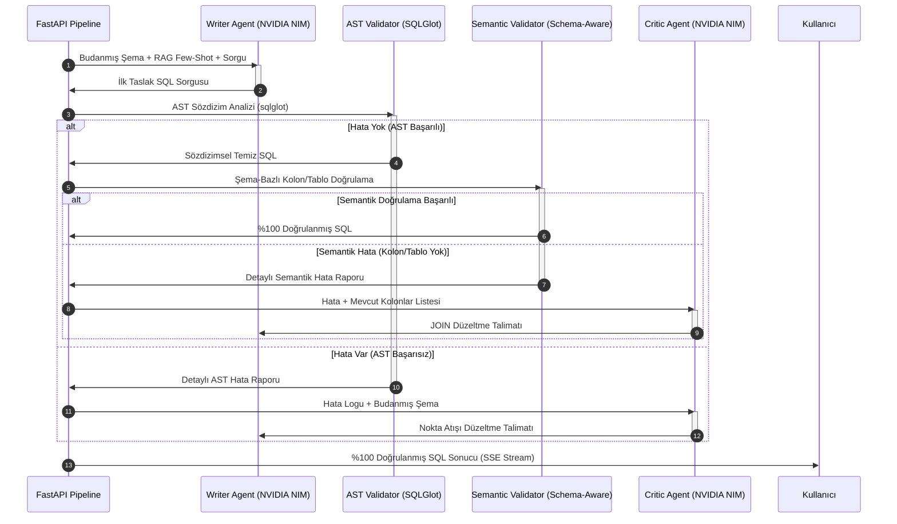

# SQLGen — Teknik Özellik Dokümantasyonu (FEATURE.md)

Bu belgede, SQLGen bünyesindeki tüm ana özelliklerin teknik çalışma prensipleri, mimari yaklaşımları ve kod katmanlarındaki detayları açıklanmıştır.

---

## 1. Çok Katmanlı Şema İlişki Motoru (Multi-Layer Relation Engine)

Geleneksel Text-to-SQL çözümleri, yalnızca veritabanındaki fiziksel Foreign Key (FK) ilişkilerini okuyabilir. SQLGen ise fiziksel şema sınırlarını aşarak kurumsal veritabanlarının gerçek dünyadaki yapısal dağınıklığını çözen dört katmanlı bir ilişki motoru barındırır.

```
┌─────────────────────────────────────────────────────────┐
│               SchemaManager.load_schema()               │
└────────────────────────────┬────────────────────────────┘
                             │
       ┌─────────────────────┼─────────────────────┐
       ▼                     ▼                     ▼
┌──────────────┐     ┌──────────────┐     ┌──────────────┐
│  Explicit    │     │   Custom     │     │  Implicit    │
│ (Fiziksel FK)│     │  (Manuel)    │     │   (Örtük)    │
└──────┬───────┘     └──────┬───────┘     └──────┬───────┘
       │                    │                    │
       └─────────────────────┼────────────────────┘
                             │
                             ▼
                     ┌──────────────┐
                     │   Disabled   │ (Pasifize Edilenleri Filtrele)
                     └──────┬───────┘
                            │
                            ▼
              ┌───────────────────────────┐
              │ Unified Relation Graph G  │
              └───────────────────────────┘
```

### Teknik Akış:
1. **Explicit Relations (Fiziksel FK):** SchemaManager'ın veritabanı türüne göre çağırdığı metotlar vasıtasıyla veritabanı sistem tablolarından (information_schema, all_constraints veya PRAGMA foreign_key_list) şema okunur. Çekilen her bir FK ilişkisi "type": "explicit" olarak işaretlenir.
2. **Custom / Virtual Relations (Manuel İlişkiler):** Veritabanı yöneticileri veya analistler tarafından arayüz üzerinden eklenen özel sanal ilişkiler, SQLite üzerindeki configs tablosunda custom_relations anahtarıyla saklanır. load_schema() esnasında bu JSON okunur, şemaya dinamik olarak eklenir ve "type": "custom" olarak etiketlenir.
3. **Implicit Relations (Örtük İlişkiler):** Sistem, otomatik tespit metodunu çalıştırır. Kara listede (blacklist) olmayan aynı isimdeki kolonları ve tablo_ismi_id eşleşmelerini yakalayarak fiziksel FK olmasa bile tablolar arasındaki mantıksal bağı bulur ve "type": "implicit" olarak şemaya ekler.
4. **Disabled Relations (Kısıtlamaları Filtreleme):** Kullanıcının join döngülerini veya yanlış yolları engellemek için devre dışı bıraktığı ilişkiler (disabled_relations) şemadan elenerek en optimize temiz grafik topolojisi elde edilir.

---

## 2. Grafik Tabanlı Deterministik Şema Budama (Schema Pruner)

Yapay zekanın bağlam penceresini kirletmemek ve faturaları düşürmek amacıyla geliştirilen bu algoritma iki ana adımdan oluşur:

### A. Tohum Tablo Tespiti (Entity Resolution)
SchemaPruner'ın ilgili metodu, Excel analizinden veya doğal dil sorgusundan elde edilen istek verilerini (AQR - Abstract Query Representation) üç katmanda tarayarak tohum tabloları belirler:
- **1. Katman:** AQR içerisindeki entities listesinin veritabanı tablo isimleri ile tam veya token tabanlı Jaccard Benzerliği (Similarity > 0.35) analiziyle eşleştirilmesi.
- **2. Katman:** AQR alanları (fields, filters, aggregations, sorts) içerisindeki kolonların, nokta notasyonu (tablo.kolon) veya kolon katalog taramasıyla hangi tablolara ait olduğunun bulunması.
- **3. Katman:** Doğal dil sorgusu ve iş kurallarının kelimelere (tokens) bölünerek kolon/tablo isimleri ile eşleştirilmesi.

### B. BFS Tabanlı En Kısa Yol (Join Path) Çözücü
Tohum tablolar (örneğin A ve D tabloları) belirlendikten sonra, en kısa join yollarını bulma süreci devreye girer:
- Şema, tablolardan düğüm (nodes) ve birleşik ilişkilerden kenarlar (edges) oluşacak şekilde yönsüz (undirected) bir komşuluk listesi (adjacency list) olarak kurulur.
- Her bir tohum tablo çifti (u, v) için Genişlik Öncelikli Arama (Breadth-First Search - BFS) algoritması çalıştırılır.
- BFS, iki tablo arasındaki en kısa bağlantı yolunu (örneğin A -> B -> C -> D) deterministik olarak bulur. Bu sayede aradaki köprü (B ve C) tabloları da alt şemaya otomatik olarak dahil edilir.
- **Sonuç:** Yapay zekaya 200 tablonun tamamı yerine yalnızca sorguda doğrudan veya dolaylı olarak kullanılacak olan budanmış 4 tablo gönderilir.

---

## 3. Beş Katmanlı SQL Doğrulama ve Sağlamlaştırma Motoru (Robustness Engine)

Doğal dilde yapılan küçük ifade farklılıkları (ör: "hangi ülkeden kaç sipariş" vs "ülkelere göre sipariş sayısı") aynı anlama gelmesine rağmen LLM'in farklı ve hatalı SQL üretmesine neden olabilir. SQLGen bu sorunu beş katmanlı bir savunma hattıyla çözer.

```
┌─────────────────────────────────────────────────────────┐
│              Doğal Dil Sorgusu (Türkçe)                 │
└────────────────────────────┬────────────────────────────┘
                             │
                             ▼
              ┌──────────────────────────┐
              │  Katman 0: Semantik      │  Schema Embedding Index (Cross-lingual)
              │  Embedding Eşleşme       │  "ülke" ↔ CUSTOMERS (0.82)
              └──────────────┬───────────┘
                             ▼
              ┌──────────────────────────┐
              │  Katman 2: Gelişmiş      │  Schema-Strict Instructions
              │  Writer Prompt           │  "ONLY use columns from schema"
              └──────────────┬───────────┘
                             ▼
              ┌──────────────────────────┐
              │  Katman 4: Oracle Case   │  sqlglot AST → UPPERCASE
              │  Enforcement             │  c.country → C.COUNTRY
              └──────────────┬───────────┘
                             ▼
              ┌──────────────────────────┐
              │  Katman 1: AST Semantik  │  Kolon/Tablo varlık kontrolü
              │  Doğrulama               │  COUNTRY ∉ ORDERS → HATA
              └──────────────┬───────────┘
                             ▼
              ┌──────────────────────────┐
              │  Katman 5: Critic Loop   │  Semantik hatayı Critic'e ilet
              │  (Self-Correction)       │  "Available columns: X, Y, Z"
              └──────────────┬───────────┘
                             ▼
              ┌──────────────────────────┐
              │    %100 Doğrulanmış SQL  │
              └──────────────────────────┘
```

### Teknik Detaylar:

1. **Katman 0 — Schema Embedding Index (Cross-lingual Semantic Matching):** Doğal dil sorgusundaki ifadeler ("ülke", "sipariş", "müşteri" vb.) artık statik bir sözlükle değil, dinamik bir yapay zeka vektör aramasıyla şemaya eşlenir. NVIDIA'nın 26 dilde (Türkçe dahil) optimize edilmiş `llama-3.2-nv-embedqa-1b-v2` modeli kullanılarak her tablonun "semantik parmak izi" (isim, kolonlar ve ilişkiler) embedding'e çevrilir ve `schema_cache.json`'da saklanır. Kullanıcı sorgusu geldiğinde, sorgunun embedding'i hesaplanır ve Cosine Similarity ile en yakın tablolar (tohum/seed) belirlenir. Bu, 800+ tablolu kurumsal şemalarda statik sözlüklerin kırılganlığını (technical debt) çözen, dil bağımsız (cross-lingual) ve yüksek performanslı gerçek bir mühendislik çözümüdür.

2. **Katman 2 — Schema-Strict Writer Prompt:** Writer Agent'a verilen prompt'a eklenen kritik kurallar ("`ONLY use table and column names from the provided schema`", "`For Oracle: use UPPERCASE`", "`if a column is not in a table, JOIN the table that has it`") ile LLM'in uydurma kolon üretmesi engellenir.

3. **Katman 4 — Oracle Case Enforcement:** Oracle diyalektinde üretilen SQL, `sqlglot` AST üzerinde traverse edilerek tüm tablo, kolon ve alias identifier'ları UPPERCASE'e dönüştürülür. Bu sayede ORA-00904 (invalid identifier) hataları önlenir.

4. **Katman 1 — Schema-Aware Semantik Doğrulama:** Üretilen SQL, `sqlglot` AST introspection ile ayrıştırılır ve her kolon referansı pruned schema'daki gerçek kolon listesiyle karşılaştırılır. `SELECT country FROM orders` gibi sözdizimsel olarak doğru ama semantik olarak hatalı sorgular bu katmanda yakalanır.

5. **Katman 5 — Güçlendirilmiş Critic Döngüsü:** Semantik doğrulama hatası oluştuğunda, detaylı hata mesajı ("`Column 'COUNTRY' does not exist in table 'ORDERS'. Available columns: ORDER_ID, CUSTOMER_ID, ...`") Critic Agent'a iletilir. Critic, bu bilgiyle Writer'a nokta atışı düzeltme talimatı vererek JOIN yapısının eklenmesini sağlar.

---

## 4. Çoklu Ajan Sentaks Doğrulama ve Otonom Hata Düzeltme

Text-to-SQL dünyasındaki en büyük risk, yapay zekanın uydurma kolonlar içeren veya hedef diyalektte (örneğin Oracle SQL veya Snowflake) çalışmayan hatalı kodlar üretmesidir. SQLGen bu sorunu Yazar-Eleştirmen (Writer-Critic) Çoklu Ajan Döngüsü ile aşar.



### Teknik Detaylar:
- **SQLGlot AST Analizi:** Üretilen sorgu, hedef diyalekt formatında sqlglot yardımıyla ayrıştırılır. Hata varsa ParseError yakalanır.
- **Schema-Aware Semantik Doğrulama:** AST parse sonrası, tüm tablo ve kolon referansları veritabanı şemasına karşı doğrulanır. Alias çözümlemesi (C→CUSTOMERS) ve SELECT expression alias desteği (SIPARIS_SAYISI gibi) dahildir.
- **Otonom Düzeltme (Self-Correction):** Hata oluştuğunda LLM'e sadece eski SQL ve hatayı değil, aynı zamanda şemadaki kolon tiplerini ve ilişkileri tekrar göstererek hatayı tam olarak nerede yaptığı izah edilir. Bu işlem maksimum 3 deneme boyunca tekrarlanır.

---

## 5. Qdrant ile Kurumsal RAG (Retrieval-Augmented Generation)

SQLGen'de RAG sistemi, kurumsal iş mantıklarını ve geçmiş tecrübeleri modele aktarmak için kullanılır:

- **NVIDIA NIM Embedding:** Metinler, kurumsal aramalar için optimize edilmiş standart 1024 boyutlu nvidia/embeddings-nv-embed-qa-4 modeli ile vektörleştirilir.
- **In-Memory Qdrant Entegrasyonu:** Herhangi bir Docker veya harici veri tabanı bağımlılığı gerektirmeden, uygulama ayağa kalktığında tamamen RAM üzerinde (:memory:) hızlı bir şekilde Qdrant koleksiyonları oluşturulur.
- **Koleksiyonlar:**
  - business_rules: Özel KPI'lar ve iş mantıklarını (örn. active = 1 filtresinin "aktif üyeler" anlamına geldiğini bilir) eşleştirmek için semantik arama yapılır.
  - sql_history: Few-shot öğrenme için geçmiş başarılı SQL-Soru çiftlerini filtreler.

---

## 6. Gerçek Zamanlı SSE (Server-Sent Events) Akış Mimarisi

SQL üretimi, RAG aramaları ve otonom hata düzeltme döngüleri zaman alabilir (5-15 saniye). Kullanıcı deneyimini iyileştirmek için FastAPI ve Vue 3 arasında asenkron bir log akışı kurulmuştur:

1. Kullanıcı sorgu başlattığında, FastAPI isteği alır, veritabanına bir job_id kaydeder ve süreci asenkron arka plan görevine (FastAPI BackgroundTasks) devrederek hemen 202 Accepted yanıtı döner.
2. Vue 3 istemcisi, anında /api/jobs/{job_id}/stream adresine bir Server-Sent Events (SSE) bağlantısı açar.
3. Arka planda çalışan işçi, her işlem adımında (Excel ayrıştırma, budama, LLM üretimi, AST hata tespiti) log_callback fonksiyonunu tetikler.
4. Bu fonksiyon, thread-safe bir queue.Queue yapısına logları basar.
5. FastAPI SSE yönlendiricisi asenkron olarak bu kuyruktan verileri okur ve text/event-stream formatında anlık olarak istemciye aktarır. İş tamamlandığında "EOF" sinyali ile akış kapatılır.

---

## 7. FastMCP Server ve Harici LLM Entegrasyon Katmanı

SQLGen, bağımsız çalışan bir masaüstü uygulaması olmanın ötesinde, Anthropic'in öncülük ettiği Model Context Protocol (MCP) standardını destekleyen bir MCP Server barındırır. Bu katman, mcp_server.py içerisinde FastMCP framework'ü ile kurgulanmıştır ve harici yapay zeka araçlarının (Cursor, Claude Desktop, VS Code Copilot vb.) veritabanı uzmanı olarak SQLGen'i çağırmasını sağlar.

### A. Sunulan Kritik MCP Araçları (Tools):
- get_token_optimized_schema(): Aktif veritabanı şemasını okur ve standart DDL yerine ultra sıkıştırılmış bir Pseudo-DDL formatına çevirir (Örn: Table customers (customer_id INT PK, name VARCHAR NOT NULL | FKs: id -> sales.id)). Bu sıkıştırma şemanın LLM'e taşınmasında %85-90 token tasarrufu sağlar.
- parse_excel_request_file(excel_path): Harici LLM'in, kullanıcının verdiği bir Excel veri talep şablonunu ayrıştırması gerektiğinde, SQLGen'in yerel parser modülünü çağırarak AQR yapısını JSON olarak almasını sağlar.
- generate_validated_sql(query, dialect): Harici editörün (Cursor gibi) kendi prompt penceresinden doğrudan SQLGen'in asenkron Writer-Critic ve AST doğrulama pipeline'ını tetiklemesine olanak tanır.
- design_database_schema(natural_description, target_engine): LLM'in, kullanıcının tarif ettiği iş modeline göre en optimize ilişkisel şemayı SQLGen standartlarında pseudo-DDL olarak tasarlamasını sağlar.

### B. Mimari İletişim Protokolü:
```
[ Harici Editör (Cursor/Claude) ] ──(stdio)──► [ mcp_server.py (FastMCP) ]
                                                        │
         ┌──────────────────────────────────────────────┴──────────────────────────────┐
         ▼                                              ▼                              ▼
[ SchemaManager ]                               [ parse_excel ]                [ SQLGenerationPipeline ]
- Veritabanı Şeması Çekimi                      - Excel Ayrıştırma             - Çoklu Ajan Döngüsü
- Pseudo-DDL Dönüşümü                                                          - SQLGlot AST Doğrulama
```
MCP sunucusu standart girdi/çıktı (stdio) kanalı üzerinden haberleşerek sıfır ağ gecikmesiyle yerel kaynakları harici akıllı ajanların emrine sunar.

